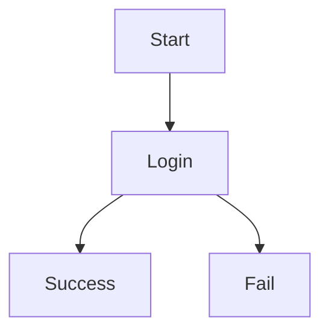
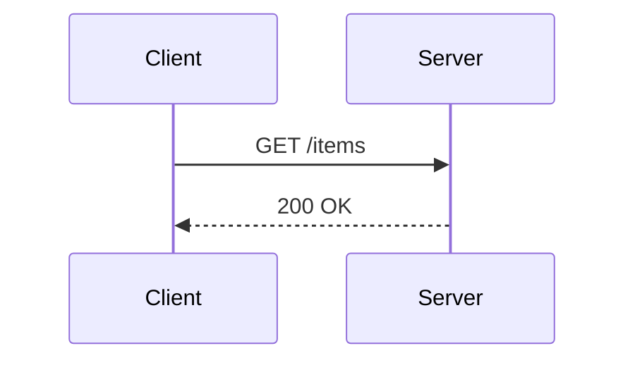
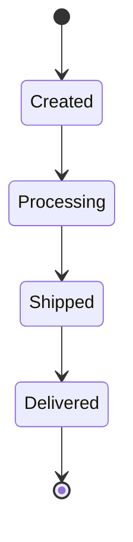
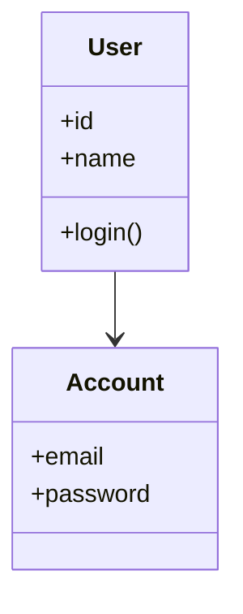
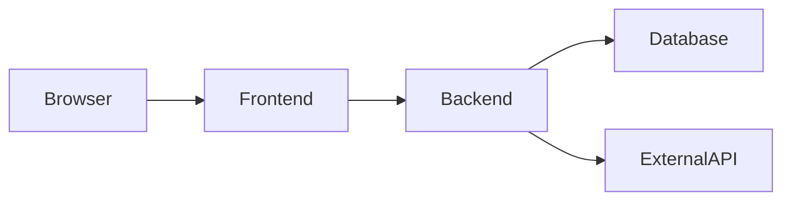

# Markdown Complete Guide

## 1. Headings

# H1 Heading

## H2 Heading

### H3 Heading

#### H4 Heading

---

## 2. Bold and Italic

**This is bold text**

_This is italic text_

**_This is bold + italic_**

---

## 3. Lists

### Bullet List

- Apple
- Banana
- Mango

### Numbered List

1. First
2. Second
3. Third

### Nested List

- Backend
  - API
  - Database
- Frontend
  - UI
  - Logic

---

## 4. Code Blocks

Inline code example:
`print("Hello")`

Multi-line code:

```python
def greet():
    print("Hello World")
```

---

## 5. Links and Images

Link example:
[Open Google](https://google.com)

Image example:


---

## 6. Tables

| Name   | Role      | Experience |
| ------ | --------- | ---------- |
| Girish | Developer | Fresher    |

---

## 7. Task Lists

- [x] Install Python
- [x] Learn Markdown
- [ ] Build Project
- [ ] Deploy App

---

## 8. Mermaid Diagram

## Flowchart



---

## Sequence Diagram



## State Diagram



## class diagram



## block diagram


