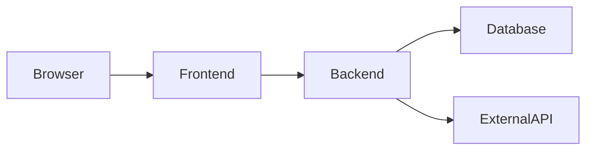
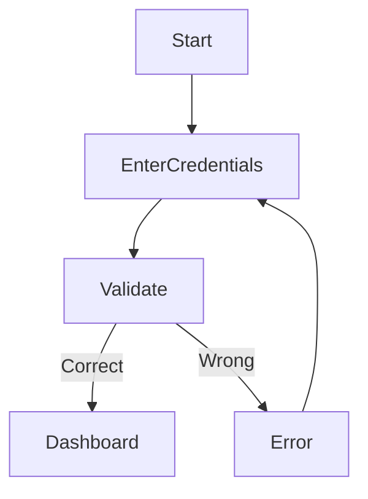
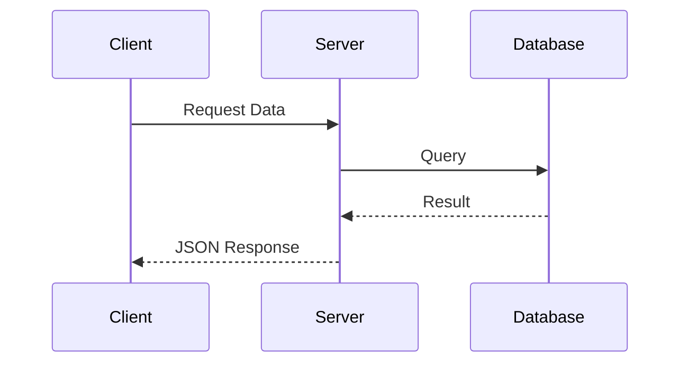
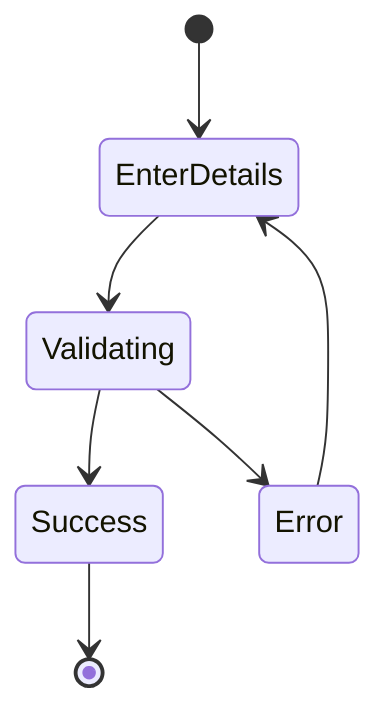
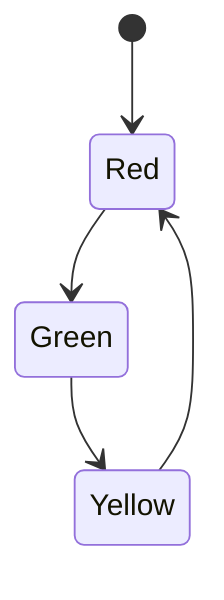

# Mermaid Diagrams

This file contains system diagrams created using Mermaid.

## Block Diagram — Web App

## Flowchart — Login Process

## Sequence Diagram — API Request

## State Diagram — Signup Flow

## state diagram traffic signal

